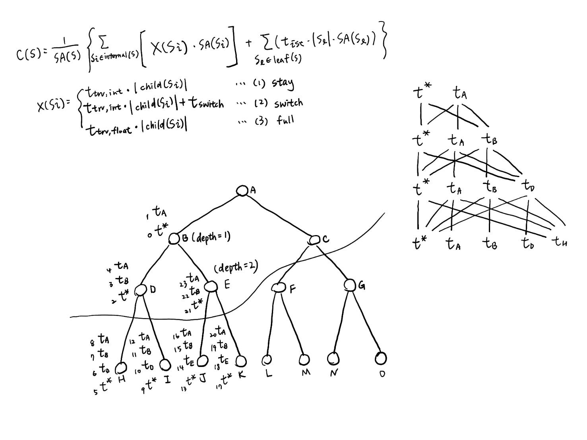

# BVH Quantization
## 建樹

## INT8 Traversal
### 和 2D bbox 相交最簡單的形式
$$t_{entry_x}=
\frac{x_{min}-x_o}{d_x}\\
t_{exit_x}=
\frac{x_{max}-x_o}{d_x}\\
t_{entry_y}=
\frac{y_{min}-y_o}{d_y}\\
t_{exit_y}=
\frac{y_{max}-y_o}{d_y}\\
t_{entry}=\max\left(
t_{entry_x},t_{entry_y}
\right)\\
t_{exit}=\min\left(
t_{exit_x},t_{exit_y}
\right)$$

如果 $t_{entry}\leq t_{exit}$，則代表光線有打到 bbox。
再把相同的概念推廣至 3D，就是我們常常見到的 bbox intersection 了。

註：上述有省略一些細節，但大方向是對的。
### 減少除法操作
例如把
$$\frac{x_{min}-x_o}{d_x}$$
換成
$$w_xx_{min}+b_x$$
其中
$$w_x=\frac{1}{d_x}$$
$$b_x=\frac{-x_o}{d_x}$$
$w_xx_{min}+b_x$ 其實就是一個 MAC。
### Quantization
#### Linear quantization for FC layer

#### 相交 bbox 和 FC layer 很像
$$ y=wx+b $$
$y$: 光線打到的時間

$w$,$x$,$b$: 如上所述
#### 把 $y$, $w$, $x$, $b$ 都 linear quantize ??
$$ S_yq_y=S_wq_wS_xq_x+S_bq_b $$
假設 
$$S_y=S_b=S_wS_x$$
則
$$S_wS_xq_y=S_wS_xq_wq_x+S_wS_xq_b$$
即
$$q_y=q_wq_x+q_b$$

這樣效果並不會到太好，原因是 $w$ 的分佈並沒有非常集中。
透過數學推導可以知道 $w$ 的分佈大概是：
$$f(x)=\frac{1}{x^2}$$

兩側的尾巴掉到 0 的速度並沒有很快，所以 $w$ 並沒有非常適合用 linear quantize 的方法。

具體來看，每個光線的方向，經過 linear quantize 之後會長得如下圖（同個顏色代表 quantize 成同一個數值）：

